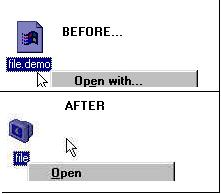



## Files Association \* UPDATED \*

### Description

Ever wanted a quick-and-easy file association for your application?

Sure you did! this is it and all in 4 functions:

1. Associate - Associate any file type with your app

2. Remove Association - quicly remove it

3. Backup Association - dumps an association to reg file

4. Restore Association - merege backup reg file/any reg file to the registry
 
### More Info
 

             |
---                |---
**Submitted On**   |2000-04-12 16:02:24
**By**             |[Max Raskin](https://github.com/Planet-Source-Code/PSCIndex/blob/master/ByAuthor/max-raskin.md)
**Level**          |Intermediate
**User Rating**    |4.8 (53 globes from 11 users)
**Compatibility**  |VB 5\.0, VB 6\.0
**Category**       |[Windows System Services](https://github.com/Planet-Source-Code/PSCIndex/blob/master/ByCategory/windows-system-services__1-35.md)
**World**          |[Visual Basic](https://github.com/Planet-Source-Code/PSCIndex/blob/master/ByWorld/visual-basic.md)
**Archive File**   |[CODE\_UPLOAD47934142000\.zip](https://github.com/Planet-Source-Code/max-raskin-files-association-updated__1-7108/archive/master.zip)

